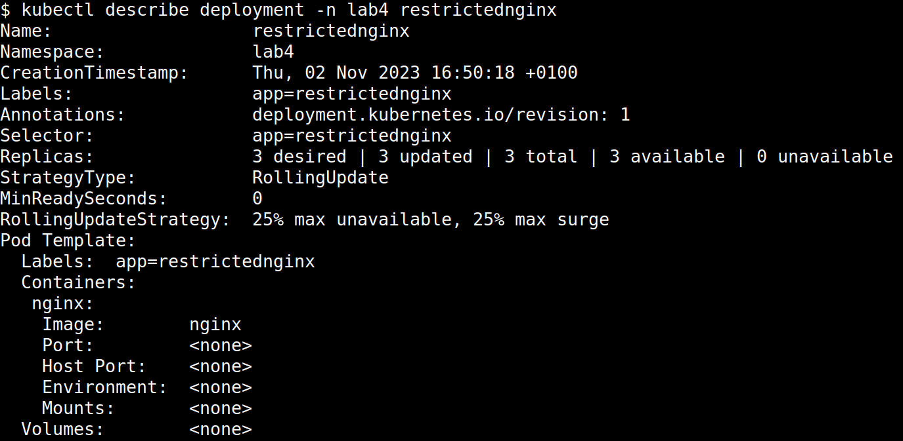

# Deployment with resource limits
Simple Kubernetes deployment with resource limits.

## Creating the deployment
1. Create the namespace (if it does not exist already):
```
kubectl create namespace lab4
```

2. Apply the resource quota:
```
kubectl apply -n lab4 -f quota.yaml
```

3. Apply the limit range:
```
kubectl apply -n lab4 -f limitRange.yml
```

4. Verify that the namespace has the correct resource limits assigned:
```
kubectl describe ns lab4
```


5. Create the deployment:
```
kubectl -n lab4 apply -f deployment.yml
```

## Verifying the solution
1. Check if the deployment was created successfully:
```
kubectl describe deployment -n lab4 restrictednginx
```


Three replicas are visible.

2. Check if the pods are running:
```
kubectl -n lab4 get pod
```


Three pods are visible.

3. Check the resource limits and requests of the pods:
```
kubectl get pod -n lab4 -o custom-columns="Name:metadata.name,CPU-limit:spec.containers[*].resources.limits.cpu,RAM-limit:spec.containers[*].resources.limits.memory,CPU-request:spec.containers[*].resources.requests.cpu,RAM-request:spec.containers[*].resources.requests.memory"
```


Each pod has a 250m CPU limit and 256 MiB memory limit.
Each pod requests 125m CPU and 64 MiB of RAM memory.

4. Check other information about the pods:
```
kubectl describe pod -n lab4
```
Three pods with the specified resource limits and request are visible in the output of `kubectl describe`` command.
